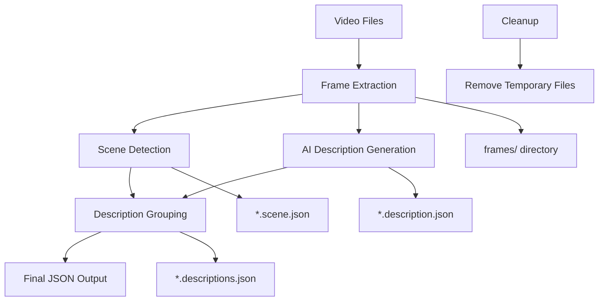

# 🎬 Video Processing Pipeline

[](https://python.org)
[](https://ffmpeg.org)
[](LICENSE)

A sophisticated video processing pipeline that transforms raw video files into structured, AI-analyzed descriptions with scene detection and semantic grouping.

## ✨ Features

- 🖼️ **Smart Frame Extraction** - Extract frames at configurable intervals with 720p downscaling
- 🎭 **Scene Detection** - Automatically detect scene changes using FFmpeg's scene filter
- 🤖 **AI-Powered Descriptions** - Generate frame descriptions using MLX VLM (FastVLM-0.5B)
- 🔗 **Semantic Grouping** - Group similar consecutive descriptions using sequence matching
- 🚀 **Complete Pipeline** - One-command processing from video to structured JSON output
- 🔄 **Resumable Processing** - Skip already processed files for efficiency
- 🧹 **Smart Cleanup** - Remove temporary files while preserving final outputs
- 📊 **Rich Output** - Timestamped descriptions merged with scene change information

## 🚀 Quick Start

### Option 1: One-Command Installation (Recommended)

Install descriptor system-wide with a single curl command:

```bash
curl -sSL https://github.com/orozcoh/descriptor/main/install/curl-install.sh | bash
```

After installation, use descriptor from any directory:

```bash
# Process current directory
descriptor .

# Process specific directory
descriptor /path/to/videos

# Show help
descriptor --help
```

### Option 2: Manual Installation

#### 1. Install Dependencies

```bash
# Install Python dependencies
pip install -r requirements.txt

# Install FFmpeg (required for video processing)
# macOS:
brew install ffmpeg

# Ubuntu/Debian:
sudo apt install ffmpeg

# Windows: Download from https://ffmpeg.org/download.html
```

#### 2. Run the Complete Pipeline

```bash
# Process all videos in a directory
python3 descriptor.py path/to/folder

# Process current directory
python3 descriptor.py .

# Process with verbose output
python3 descriptor.py path/to/folder --verbose
```

**Development workflow**: Use direct `python descriptor.py` runs (with `./venv` if following Setup). Do not combine with installer to avoid duplicate venvs.

### Option 3: Local Installation

Clone the repository and run the installation script:

```bash
# Clone the repository
git clone https://github.com/orozcoh/descriptor.git
cd descriptor

# Run installation script
./install/install.sh
```

**Production/CLI workflow**: Creates isolated `./install/venv` for the system-wide `descriptor` command. **Skip manual venv setup to avoid duplication**.

**Note**: Designed for macOS Apple Silicon (M1/M2/M3+). See manual installation for other platforms.

After installation, the `descriptor` command will be available system-wide.

### 3. View Results

The pipeline generates structured JSON files with:
- Timestamped descriptions grouped by similarity
- Scene change information with thresholds
- Clean, organized folder structure

## 📋 Installation

### Prerequisites

- **Python 3.10+** (required for MLX dependencies)
- **FFmpeg** (for video processing)
- **Metal GPU** (recommended for MLX performance on macOS)

### Choose Your Workflow

| Workflow      | Venv Location   | Usage                  | When to Use                  |
|---------------|-----------------|------------------------|------------------------------|
| Manual/Dev    | `./venv`        | `python descriptor.py` | Development, testing changes |
| Installed CLI | `./install/venv`| `descriptor`           | Everyday use, system-wide    |

**Warning**: Running both workflows creates duplicate venvs—pick one!

### Setup **(Development workflow)**

Creates `./venv` in project root for direct `python descriptor.py` runs. **Skip if using the installation script (`./install/install.sh`) to avoid duplicate venvs.**

```bash
# Clone or download the project
git clone https://github.com/orozcoh/descriptor.git
cd descriptor

# Create virtual environment (recommended)
python3 -m venv venv
source venv/bin/activate  # On Windows: venv\Scripts\activate

# Install Python dependencies
pip install -r requirements.txt
```

### Dependencies

Key MLX dependencies (see `install/requirements.txt` for the full list):

```txt
mlx-lm==0.30.7      # MLX language model framework
mlx-metal==0.30.6   # MLX Metal backend for Apple Silicon
mlx-vlm==0.3.12     # MLX Vision-Language Models
timm==1.0.25        # PyTorch Image Models
```

## 🛠️ Usage Guide

### Main Pipeline: `descriptor.py`

The orchestrator script that runs the complete 5-step workflow:

```bash
python3 descriptor.py [directory_path] [options]
```

**Examples:**
```bash
# Process specific directory
python3 descriptor.py content/2026/26-week-1-2

# Process current directory
python3 descriptor.py .

# Verbose output
python3 descriptor.py content/2026/26-week-1-2 --verbose
```

**Pipeline Steps:**
1. 📸 **Frame Extraction** - Extract frames from videos
2. 🎬 **Scene Detection** - Identify scene changes
3. 🤖 **AI Description** - Generate descriptions for frames
4. 🔗 **Description Grouping** - Group similar descriptions
5. 🧹 **Cleanup** - Remove temporary files

---

### Individual Scripts

#### Frame Extractor: `frame-extractor.py`

Extract frames from video files at specified intervals.

```bash
python3 scripts/frame-extractor.py [directory] [options]
```

**Options:**
- `-i, --interval` - Time interval between frames in seconds (default: 1.0)
- `-v, --verbose` - Enable verbose output

**Examples:**
```bash
# Extract frames every 1 second
python3 scripts/frame-extractor.py content/2026/26-week-1-2

# Extract frames every 0.5 seconds
python3 scripts/frame-extractor.py content/2026/26-week-1-2 -i 0.5

# Verbose output
python3 scripts/frame-extractor.py content/2026/26-week-1-2 -v
```

**Output:** PNG frames in `frames/` subdirectory, scaled to 720p

---

#### Scene Extractor: `scene-extractor.py`

Detect scene changes in video files using FFmpeg.

```bash
python3 scripts/scene-extractor.py [directory] [options]
```

**Options:**
- `-t, --threshold` - Scene change detection threshold (0.0-1.0, default: 0.4)
- `-v, --verbose` - Enable verbose output

**Examples:**
```bash
# Detect scenes with default threshold
python3 scripts/scene-extractor.py content/2026/26-week-1-2

# Use custom threshold
python3 scripts/scene-extractor.py content/2026/26-week-1-2 -t 0.6

# Verbose output
python3 scripts/scene-extractor.py content/2026/26-week-1-2 -v
```

**Output:** `*.scene.json` files with scene change timestamps and scores

---

#### AI Description: `describeAI.py`

Generate AI descriptions for video frames using MLX VLM.

```bash
python3 scripts/describeAI.py [folder_path] [options]
```

**Options:**
- `-v, --verbose` - Enable verbose output

**Examples:**
```bash
# Generate descriptions for frames in a folder
python3 scripts/describeAI.py content/2026/26-week-1-2

# Verbose output
python3 scripts/describeAI.py content/2026/26-week-1-2 -v
```

**Requirements:** Must be run in a folder containing a `frames/` directory

**Output:** `*.description.json` files with timestamped descriptions

---

#### Description Grouping: `des-group.py`

Group similar consecutive descriptions into time ranges.

```bash
python3 scripts/des-group.py [directory] [options]
```

**Options:**
- `--threshold` - Similarity threshold for grouping (0.0-1.0, default: 0.8)
- `-v, --verbose` - Enable verbose output

**Examples:**
```bash
# Group descriptions with default threshold
python3 scripts/des-group.py content/2026/26-week-1-2

# Use custom similarity threshold
python3 scripts/des-group.py content/2026/26-week-1-2 --threshold 0.75

# Verbose output
python3 scripts/des-group.py content/2026/26-week-1-2 -v
```

**Requirements:** Requires both `*.description.json` and `*.scene.json` files

**Output:** `*.descriptions.json` files with grouped descriptions and scene data

---

#### Cleanup Utility: `clear-files.py`

Remove temporary files created during processing.

```bash
python3 scripts/clear-files.py [target] [options]
```

**Targets:**
- `frames` - Remove only frames directories
- `description` - Remove only `.description.json` files
- `descriptions` - Remove only `.descriptions.json` files
- `scenes` - Remove only `.scene.json` files
- `purge` - Remove everything (with confirmation)

**Options:**
- `-v, --verbose` - Enable verbose output

**Examples:**
```bash
# Remove frames directories only
python3 scripts/clear-files.py frames

# Remove all temporary files (with confirmation)
python3 scripts/clear-files.py purge

# Remove descriptions in specific directory
python3 scripts/clear-files.py description content/2026/26-week-1-2

# Verbose output
python3 scripts/clear-files.py purge -v
```

## 🔄 Workflow Diagram



## 📊 Output Format

### Grouped Descriptions with Scene Data

```json
{
  "folder": "content/2026/26-week-1-2",
  "videos": {
    "VID_20260224_123820": {
      "timestamps": [
        {
          "start_time": "000:00:00.000",
          "end_time": "000:00:03.000",
          "description": "A person is walking on a sidewalk with a green line painted on it."
        },
        {
          "start_time": "000:00:04.000",
          "end_time": "000:00:05.000",
          "description": "A street scene with a tall building in the background and a person riding a motorcycle."
        }
      ],
      "scenes-info": {
        "scene_threshold": 0.4,
        "total_scenes": 2,
        "scenes": [
          {
            "scene_number": 1,
            "start_time": "00:00:00.000",
            "end_time": "00:00:03.125",
            "duration": 3.125,
            "scene_changes": [
              {
                "frame_number": 123,
                "timestamp": "00:00:02.100000",
                "seconds": 2.1,
                "scene_score": 0.45
              }
            ]
          }
        ]
      }
    }
  }
}
```

### Frame Descriptions (Intermediate)

```json
{
  "000:00:00.000": "A black elevator control panel with a red arrow pointing down.",
  "000:00:01.000": "A black and white image of an elevator control panel.",
  "000:00:02.000": "A black and white elevator with a red arrow pointing down.",
  "000:00:03.000": "A close-up of an elevator floor with a keypad and a yellow button."
}
```

### Scene Data (Intermediate)

```json
{
  "video_file": "content/2026/26-week-1-2/VID_20260224_123820.mp4",
  "scene_threshold": 0.4,
  "total_scenes": 1,
  "scenes": [
    {
      "scene_number": 1,
      "start_time": "00:00:00.000",
      "end_time": "00:00:05.627",
      "duration": 5.626967,
      "scene_changes": []
    }
  ]
}
```

## 🐛 Troubleshooting

### Common Issues

**1. FFmpeg not found**
```bash
# Install FFmpeg
brew install ffmpeg  # macOS
sudo apt install ffmpeg  # Ubuntu/Debian
```

**2. Python version too old**
```bash
# Check Python version
python3 --version

# MLX requires Python 3.10+
# Install latest Python if needed
```

**3. MLX installation issues**
```bash
# Ensure you're using Python 3.10+
# Install MLX dependencies
pip install mlx-lm mlx-vlm timm
```

**4. Permission errors**
```bash
# Ensure write permissions in target directory
chmod -R u+w content/
```

**5. Duplicate virtual environments**
If you have both `./venv` (dev) and `./install/venv` (CLI), remove the unused one:
```bash
rm -rf ./venv     # Remove dev venv (keep CLI)
# or
rm -rf ./install/venv  # Remove CLI venv (keep dev)
```
Then use the matching workflow: `python descriptor.py` (dev) or `descriptor` (CLI).

### Performance Tips

- **Use Apple Silicon**: MLX performs best on Apple Silicon Macs with Metal
- **Frame interval**: Use larger intervals (2-5 seconds) for long videos
- **Scene threshold**: Adjust based on video content (0.3-0.6 typical range)
- **Memory**: Large videos may require significant RAM for frame extraction

## 🤝 Contributing

1. Fork the repository
2. Create a feature branch (`git checkout -b feature/amazing-feature`)
3. Commit your changes (`git commit -m 'Add amazing feature'`)
4. Push to the branch (`git push origin feature/amazing-feature`)
5. Open a Pull Request

## 📄 License

This project is licensed under the MIT License - see the [LICENSE](LICENSE) file for details.

## 🙏 Acknowledgments

- **MLX** - For the powerful vision-language models
- **FFmpeg** - For robust video processing capabilities
- **SequenceMatcher** - For semantic similarity detection

---

**Built with ❤️ for video analysis and AI-powered content understanding**